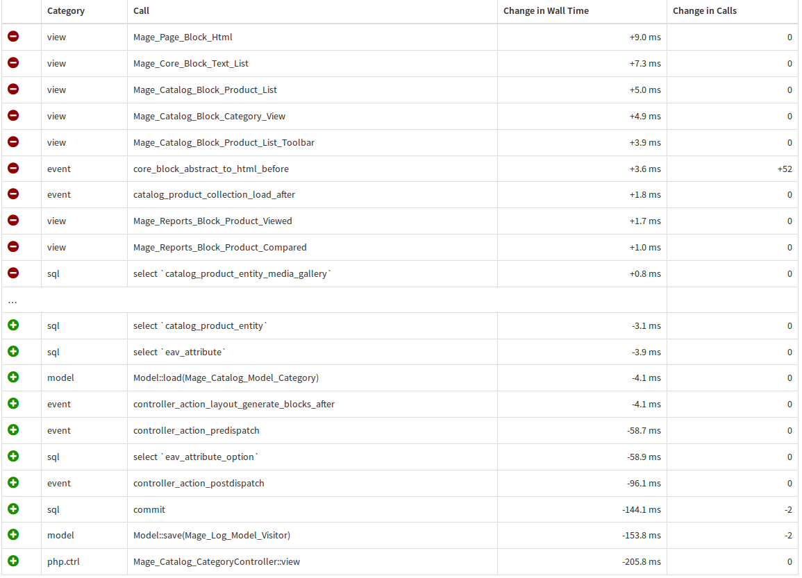

FireGento_PerformanceTweaks
===========================

This extension is based on the slides of Ivan Chepurnyi, available at
http://de.slideshare.net/ivanchepurnyi/magento-performance.

Facts
-----

* Version: check [config.xml](https://github.com/firegento/magento-performance-tweaks/blob/master/app/code/community/FireGento/PerformanceTweaks/etc/config.xml)
* Repository: https://github.com/firegento/magento-performance-tweaks/
* Composer name: `firegento/performance-tweaks`

Drawbacks
---------

This extension disables visitor logs and directly impacts product compare and recently viewed.
Possible symptoms:
- Not logged in users cannot use compare
- Logged in users share the whole compare table

time differences
--------------------------------

profiles done via [tideways.io](https://tideways.io)

#### time difference on category page

done for 33386f57393ffb41602fd93255de8dae2f852ce5

Support
-------
If you encounter any problems or bugs, please create an issue on
[GitHub](https://github.com/firegento/magento-performance-tweaks/issues).

Contribution
------------
Any contribution is highly welcome. The best possibility to provide any code is to open
a [pull request on GitHub](https://help.github.com/articles/using-pull-requests).

Contributors
------------
 <!-- ALL-CONTRIBUTORS-LIST:START - Do not remove or modify this section -->
<!-- prettier-ignore-start -->
<!-- markdownlint-disable -->
<table>
  <tr>
    <td align="center"><a href="http://www.fabian-blechschmidt.de"> <b>Fabian Blechschmidt</b></a></td>
    <td align="center"><a href="https://github.com/SiM"> <b>sim</b></a></td>
  </tr>
</table>

<!-- markdownlint-enable -->
<!-- prettier-ignore-end -->
<!-- ALL-CONTRIBUTORS-LIST:END -->
 
License
-------
[GNU General Public License, version 3 (GPLv3)](http://opensource.org/licenses/gpl-3.0)

